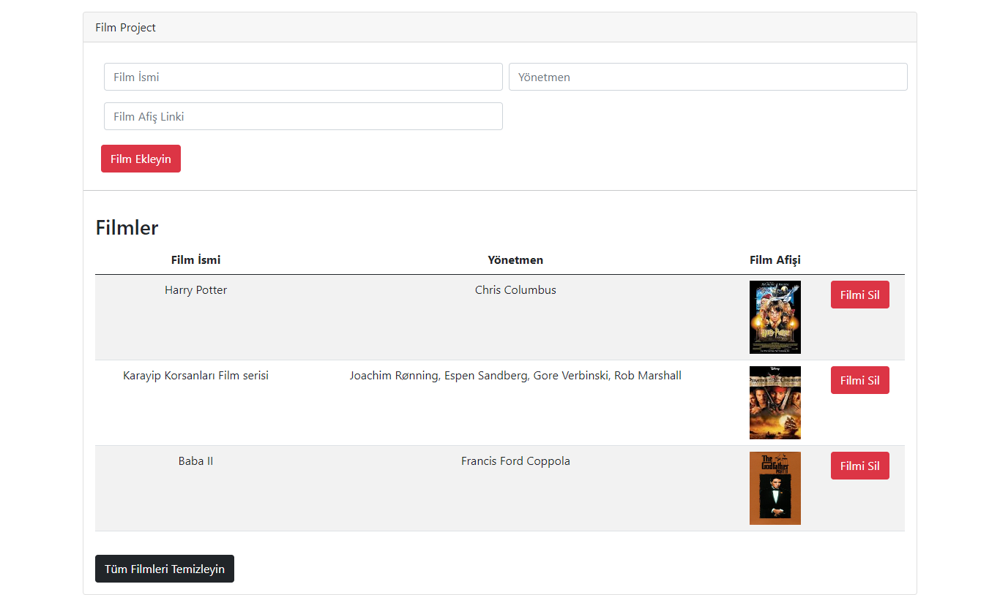

# FilmList-Ecmascript6
### Bu projede bir film listesi formu oluşturdum. Bu formda listeye Film ekleyebilir, çıkarabilir ve tüm listeyi silebilirsiniz. Projeyi ilk önce Es5 versiyonuna göre kodladıktan sonra Es6 versiyonuna çevirdim. Bu şekil yapmam da ki amaç ilk önce Es5 prototype ve inheritance kavramını kavramak daha sonra da Es6 class yapısnı pekiştirmekti.
